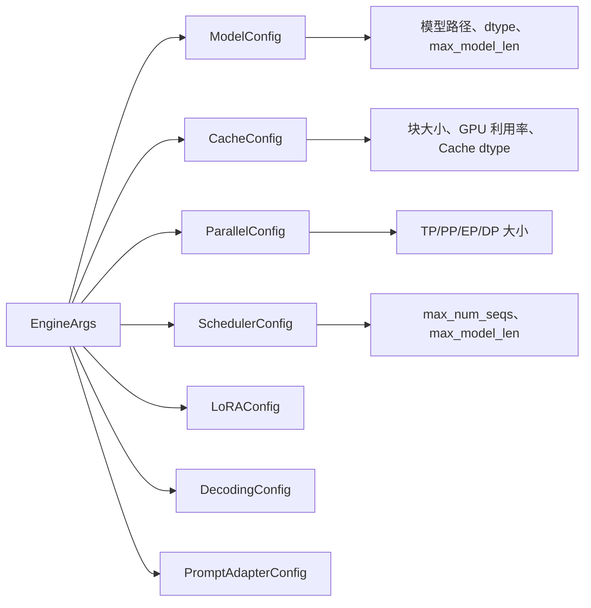

# 配置系统

> vLLM 的配置采用**双层架构**：环境变量层 + 引擎参数层。理解这套配置系统是掌握整个框架的起点。

## 为什么需要双层配置？

vLLM 需要同时服务两类用户：

- **最终用户**：通过 CLI 参数启动服务（`vllm serve --model xxx`）
- **开发者/高级用户**：通过环境变量微调底层行为（如选择 attention backend、控制内存分配）

这催生了双层设计：

```
CLI 参数 ──→ EngineArgs ──→ ModelConfig
                              CacheConfig
环境变量 ──→ envs.py  ──→    ParallelConfig
                              SchedulerConfig
                                    ⋮
```

- `EngineArgs`：面向用户的可读参数（模型路径、并行度等）
- `envs.py`：面向开发者的底层开关（调试模式、后端选择等）

---

## 1. 环境变量系统（`vllm/envs.py`）

### 文件位置

`vllm/envs.py`（~104KB，约 2500 行）—— vLLM 最大的单文件之一。

### 设计模式

每个环境变量遵循统一的定义模式：

```python
# 典型的环境变量定义
VLLM_ATTENTION_BACKEND: str = "VLLM_ATTENTION_BACKEND"
VLLM_USE_V1: bool = "VLLM_USE_V1"
VLLM_GPU_MEMORY_UTILIZATION: float = "VLLM_GPU_MEMORY_UTILIZATION"
```

每个变量调用 `envs().` 访问，背后使用 `os.environ.get()` 读取并缓存。

### 按功能分类的关键环境变量

#### GPU 内存控制
| 变量名 | 默认值 | 说明 |
|--------|--------|------|
| `VLLM_GPU_MEMORY_UTILIZATION` | `0.9` | GPU 显存使用率上限 |
| `VLLM_KV_CACHE_DTYPE` | `auto` | KV Cache 数据类型 |
| `VLLM_KV_CACHE_SIZE` | `None` | 手动指定 KV Cache 大小（块数） |

#### 注意力后端选择
| 变量名 | 默认值 | 说明 |
|--------|--------|------|
| `VLLM_ATTENTION_BACKEND` | `auto` | 强制指定注意力后端 |
| `VLLM_USE_V1` | `True` | 启用 v1 推理引擎 |

#### 调度与批处理
| 变量名 | 默认值 | 说明 |
|--------|--------|------|
| `VLLM_MAX_NUM_SEQS` | `256` | 最大并行序列数 |
| `VLLM_MAX_LOGPROBS` | `5` | 最大 logprobs 返回数 |

#### 调试与开发
| 变量名 | 默认值 | 说明 |
|--------|--------|------|
| `VLLM_USE_PRECOMPILED` | `False` | 使用预编译 wheel |
| `VLLM_LOG_LEVEL` | `INFO` | 日志级别 |
| `VLLM_TRACE_FUNCTION` | `0` | 函数级追踪 |

### 阅读要点

打开 `vllm/envs.py` 后，不要逐行阅读。建议：

1. **搜索特定变量名**：找到你需要了解的配置项
2. **关注 `_VLLM_DEV_*` 前缀**：这些是开发中的实验性功能
3. **理解 `get_vllm_config()` 函数**：这是环境变量的统一入口
4. **查看 `VLLM_TARGET_DEVICE`**：了解多硬件支持逻辑

---

## 2. 引擎参数系统（`vllm/engine/arg_utils.py`）

### 文件位置

`vllm/engine/arg_utils.py`（~117KB，约 3000 行）—— vLLM 最大的文件之一。

### `EngineArgs` 类

`EngineArgs` 是所有引擎参数的统一容器，定义了 **100+ 个字段**，涵盖：

```python
@dataclass
class EngineArgs:
    # 模型参数
    model: str                    # 模型名称/路径
    task: str = "generate"       # 任务类型
    trust_remote_code: bool = False
    dtype: str = "auto"
    max_model_len: Optional[int] = None

    # 并行参数
    tensor_parallel_size: int = 1
    pipeline_parallel_size: int = 1
    data_parallel_size: int = 1
    expert_parallel_size: int = 1

    # 内存与调度
    max_num_seqs: int = 256
    max_num_batched_tokens: int = 8192
    gpu_memory_utilization: float = 0.9

    # 量化
    quantization: Optional[str] = None
    kv_cache_dtype: str = "auto"

    # 服务参数
    port: int = 8000
    host: str = "0.0.0.0"
    # ... 100+ 更多字段
```

### 配置生产管线

`EngineArgs` 通过 `create_engine_configs()` 方法将扁平参数转换为多个配置对象：

```python
def create_engine_configs(self) -> tuple[
    ModelConfig, CacheConfig, ParallelConfig, SchedulerConfig,
    LoRAConfig, DecodingConfig, ...
]:
    model_config = ModelConfig(...)
    cache_config = CacheConfig(...)
    parallel_config = ParallelConfig(...)
    scheduler_config = SchedulerConfig(...)
    # ...
    return model_config, cache_config, ...
```

### 关键配置对象

每个配置对象对应一个特定的功能域：



### CLI 入口

CLI 参数通过 `add_cli_args()` 方法注册到 argparse：

```python
@classmethod
def add_cli_args(cls, parser: FlexibleArgumentParser):
    # 模型参数组
    group = parser.add_argument_group("Model parameters")
    group.add_argument("--model", type=str, required=True)
    group.add_argument("--dtype", type=str, default="auto")
    # ... 注册所有参数
```

然后 `vllm serve` 命令会解析这些参数并传入 `EngineArgs`。

---

## 3. 平台抽象层（`vllm/platforms/`）

### 核心概念

不同硬件平台（NVIDIA CUDA、AMD ROCm、Intel CPU、Google TPU、昇腾 NPU）对 vLLM 来说有截然不同的特性：
- 不同的编译器（NVCC vs HIP）
- 不同的算子库（cuBLAS vs rocBLAS）
- 不同的内存管理（CUDA unified memory vs ...）

平台抽象层的目的就是**封装这些差异**。

### 目录结构

```
vllm/platforms/
├── __init__.py       # 自动检测平台
├── cuda_platform.py   # NVIDIA GPU
├── rocm_platform.py   # AMD GPU
├── cpu_platform.py    # CPU (Intel/AMD)
├── tpu_platform.py    # Google TPU
└── xpu_platform.py    # Intel XPU (昇腾?)
```

### 自动检测逻辑

在 `__init__.py` 中，vLLM 通过 torch 的 `torch.cuda.is_available()` 等方法自动判断当前平台：

```python
def get_platform() -> Platform:
    if torch.cuda.is_available():
        # 进一步判断 CUDA 还是 ROCm
        if torch.version.hip:
            return RocmPlatform()
        return CudaPlatform()
    elif hasattr(torch, 'xpu') and torch.xpu.is_available():
        return XPUPlatform()
    # ...
```

### `Platform` 基类的关键方法

```python
class Platform(ABC):
    @abstractmethod
    def get_device_name(self) -> str: ...
    @abstractmethod
    def is_pin_memory_supported(self) -> bool: ...
    def get_attention_backend_cls(self) -> type: ...
    def get_default_attn_backend(self) -> str: ...
```

平台抽象直接影响：
- 注意力后端的选择
- 内存分配策略
- 编译器开关

---

## 学习产出清单

完成本节后，你应该能回答：

- [ ] `EngineArgs` 到各 Config 对象的转换路径是什么？
- [ ] `VLLM_GPU_MEMORY_UTILIZATION` 如何影响 KV Cache 的大小？
- [ ] 平台抽象层如何影响 Attention Backend 的选择？
- [ ] `max_num_seqs` 和 `max_model_len` 在哪个配置对象中定义？
- [ ] 如何通过 CLI 参数和/或环境变量强制使用 FlashInfer 后端？

## 思考题

1. **追踪练习**：从 `vllm serve --model meta-llama/Llama-2-7b --tensor-parallel-size 2` 这个命令开始，追踪引擎参数的完整解析路径，直到 `ParallelConfig` 被创建。

2. **配置冲突**：如果 `envs.py` 中的环境变量和 `EngineArgs` 中的参数都设置了 `max_num_seqs`，哪个会生效？为什么？

3. **平台扩展**：如果你想新增一个 `MUSA`（摩尔线程）平台，需要实现 `Platform` 的哪些方法？搜索 `cuda_platform.py` 作为参考。

## 下一步

继续阅读 [日志、追踪与监控](02-logging-monitoring.md)，了解 vLLM 的分布式日志系统。

---

> **代码参考**：`vllm/envs.py`、`vllm/engine/arg_utils.py`、`vllm/config/`、`vllm/platforms/`
