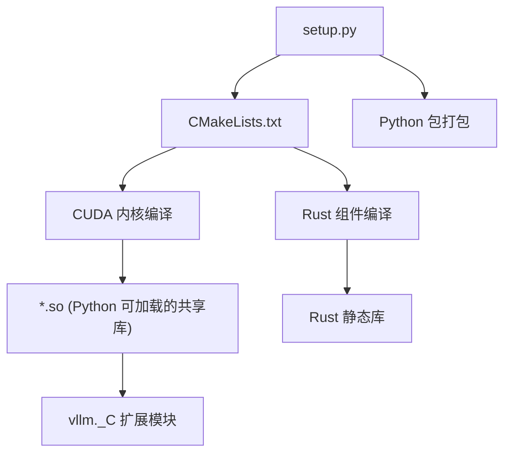

# 编译与构建系统

> vLLM 不是纯 Python 项目——它的核心性能来自于用 CUDA C++ 编写的自定义内核。理解构建系统，就是理解 Python 和 C++/CUDA **如何衔接**。

---

## 1. 总体架构

vLLM 的构建流程分为三层：



- **`setup.py`**：Python 包的入口，通过 `torch.utils.cpp_extension` 调用 CMake
- **`CMakeLists.txt`**：底层 C++/CUDA 编译
- **`csrc/torch_bindings.cpp`**：C++ 到 Python 的绑定

---

## 2. Python 包构建（`setup.py`）

### 文件位置

`setup.py`（~50KB，约 1200 行）—— vLLM 的打包和扩展注册中心。

### 扩展注册

核心任务是注册 CUDA 扩展模块：

```python
# setup.py 简化示意
from torch.utils.cpp_extension import CUDAExtension, BuildExtension

ext_modules = [
    CUDAExtension(
        name="vllm._C",                # Python 导入名
        sources=[
            "csrc/torch_bindings.cpp",   # 绑定入口
            "csrc/attention/paged_attention_v1.cu",
            "csrc/attention/paged_attention_v2.cu",
            "csrc/moe/topk_softmax.cu",
            # ... 数十个 .cu 和 .cpp 文件
        ],
        extra_compile_args={
            "cxx": ["-O3", "-std=c++17"],
            "nvcc": ["-O3", "--use_fast_math"],
        },
    ),
]
```

关键点：
- **`name="vllm._C"`**：意味着在 Python 中通过 `import vllm._C` 调用
- **`sources` 列表**：包含所有要编译的 `.cpp` 和 `.cu` 文件
- **`extra_compile_args`**：编译优化选项

### `VLLM_USE_PRECOMPILED`

```python
# 环境变量控制
if os.environ.get("VLLM_USE_PRECOMPILED"):
    # 跳过编译，直接使用预编译的 wheel
    ext_modules = []
```

这个模式用于：
- **减少安装时间**：从几分钟降低到几秒
- **CI/CD 流水线**：预编译后分发

### 条件编译

不同平台的条件编译：

```python
if sys.platform == "linux":
    ext_modules.append(...)  # Linux 特有的扩展
if not torch.version.hip:
    ext_modules.append(...)  # 非 ROCm 平台
```

---

## 3. CMake 构建层（`CMakeLists.txt`）

### 文件位置

`CMakeLists.txt`（~63KB，约 1600 行）—— vLLM 的 C++/CUDA 编译配置。

### 为什么需要 CMake？

`setup.py` 中的 `CUDAExtension` 虽然可以编译简单项目，但 vLLM 的 C++ 部分过于复杂：

- 数十个 CUDA 内核文件
- 依赖外部库（FlashAttention、CUTLASS）
- 需要精细的编译选项控制

因此 vLLM 使用 CMake 作为底层构建系统，`setup.py` 通过 `cmake` 命令调用它。

### 关键 CMake 结构

```cmake
# CMakeLists.txt 简化示意
cmake_minimum_required(VERSION 3.21)
project(vllm LANGUAGES CXX CUDA)

# CUDA 架构目标
set(CMAKE_CUDA_ARCHITECTURES "80;89;90")
# 80 = Ampere (A100)
# 89 = Ada Lovelace (RTX 4090)
# 90 = Hopper (H100)

# 子目录
add_subdirectory(csrc/attention)
add_subdirectory(csrc/moe)
add_subdirectory(csrc/quantization)
# ...

# FlashAttention 集成
find_package(FlashAttention REQUIRED)
target_link_libraries(vllm PRIVATE FlashAttention::flash_attn)
```

### 子目录结构

```
csrc/
├── attention/         # PagedAttention CUDA 内核
│   ├── paged_attention_v1.cu
│   └── paged_attention_v2.cu
├── core/              # 核心调度操作
├── moe/               # MoE 内核 (top-k softmax 等)
├── quantization/      # 量化内核 (AWQ, GPTQ, FP8)
├── cutlass_extensions/ # CUTLASS 模板特化
└── ...
```

---

## 4. Python↔C++ 绑定（`torch_bindings.cpp`）

### 文件位置

`csrc/torch_bindings.cpp`（~1.5KB）—— 连接 Python 和 C++ 的桥梁。

### 绑定机制

使用 `pybind11`（PyTorch 内置了 `torch::Library` 或直接使用 `pybind11`）：

```cpp
// torch_bindings.cpp 简化示意
#include <torch/extension.h>

// 声明 CUDA 函数（在 .cu 文件中实现）
void paged_attention_v1(
    torch::Tensor out,
    torch::Tensor query,
    torch::Tensor key_cache,
    torch::Tensor value_cache,
    // ... 更多参数
);

// 绑定到 Python
PYBIND11_MODULE(vllm, m) {
    m.def("paged_attention_v1", &paged_attention_v1,
          "PagedAttention v1 kernel");
    m.def("paged_attention_v2", &paged_attention_v2,
          "PagedAttention v2 kernel");
    m.def("rms_norm", &rms_norm, "RMS normalization");
    m.def("silu_and_mul", &silu_and_mul, "SiLU + Multiply fusion");
    // ... 数十个绑定
}
```

**绑定后，在 Python 中调用**：

```python
# vllm/_custom_ops.py
import vllm._C

def paged_attention_v1(*args, **kwargs):
    return vllm._C.paged_attention_v1(*args, **kwargs)
```

### `_custom_ops.py` 的角色

`vllm/_custom_ops.py`（~118KB）是所有自定义操作的 Python 封装。它的职责：

1. **统一接口**：将 C++ 绑定的底层函数包装为更 Pythonic 的 API
2. **参数校验**：检查 tensor shape、dtype 等
3. **自动 fallback**：如果 C++ 扩展不可用，使用纯 PyTorch 实现
4. **分派逻辑**：根据硬件/配置选择不同的 kernel 版本

```python
# _custom_ops.py 中的典型模式
def rms_norm(hidden_states: torch.Tensor, weight: torch.Tensor,
             eps: float) -> torch.Tensor:
    """RMS normalization"""
    try:
        return vllm._C.rms_norm(hidden_states, weight, eps)
    except AttributeError:
        # fallback: 纯 PyTorch 实现
        return _rms_norm_python(hidden_states, weight, eps)
```

### 另一个封装：`_aiter_ops.py`

`vllm/_aiter_ops.py`（~100KB）封装的是与**异步迭代**相关的操作，主要用于 v1 架构中的异步处理流程。

---

## 5. Rust 组件

### 文件位置

`rust/` 目录 + `rust-toolchain.toml` + `build_rust.sh`

### 为什么需要 Rust？

Rust 用于实现**高性能的并发原语**，主要场景：

- **分布式协调**：多节点之间的无锁通信
- **KV Cache 传输**：跨节点的低延迟数据传输
- **内存池管理**：高并发场景下的内存分配

### 构建方式

```bash
# Rust 组件通过 build_rust.sh 构建
cd vllm
./build_rust.sh
```

Rust 代码被编译为静态库，然后通过 CFFI 或 C 绑定从 Python 调用。

---

## 6. 依赖管理（`requirements/`）

### 目录结构

```
requirements/
├── common.txt              # 通用依赖
├── cuda.in                 # CUDA 测试依赖
├── rocm.in                 # ROCm 测试依赖
├── xpu.in                  # XPU 依赖
├── build.txt               # 构建依赖
└── lint.txt                # 代码检查工具
```

### PyTorch 后端的依赖选择

通过 `--torch-backend=auto` 参数，`uv pip install -e .` 会自动根据硬件选择正确的 PyTorch 版本：

```
# CUDA: torch + CUDA 12.x
# ROCm: torch + ROCm
# CPU:  torch --cpu
```

---

## 学习产出清单

完成本节后，你应该能回答：

- [ ] `setup.py` 如何将 CUDA 代码注册为 Python 可调用的扩展？
- [ ] `VLLM_USE_PRECOMPILED` 环境变量有什么作用？
- [ ] `torch_bindings.cpp` 中 `PYBIND11_MODULE(vllm, m)` 的作用是什么？
- [ ] `_custom_ops.py` 中的 fallback 机制是如何工作的？
- [ ] Rust 组件在 vLLM 中扮演什么角色？
- [ ] CMake 构建中 `CMAKE_CUDA_ARCHITECTURES` 配置了什么？

## 思考题

1. **调用追踪**：追踪 `rms_norm` 函数的完整调用链：
   ```
   Python: model → layers/layernorm.py → _custom_ops.py
   → C++: torch_bindings.cpp → CUDA: layernorm_kernel.cu
   ```

2. **新增 Kernel**：如果要在 vLLM 中添加一个新的 CUDA kernel（如 `flash_attention_v3`），需要修改哪些文件和哪些步骤？

3. **编译优化**：为什么 vLLM 使用 CMake 而不是直接在 setup.py 中用 `CUDAExtension` 编译所有文件？CMake 带来了哪些好处？

## 全部章节完成

恭喜！你已经完成了 **阶段一：系统底座** 的学习。你现在应该对 vLLM 的整体配置、日志监控和构建系统有了扎实的理解。

接下来请进入 **阶段二：核心推理管线**，深入学习 vLLM 的灵魂——PagedAttention、调度器和推理引擎。

---

> **代码参考**：`setup.py`、`CMakeLists.txt`、`csrc/torch_bindings.cpp`、`vllm/_custom_ops.py`、`vllm/_aiter_ops.py`、`rust/`
