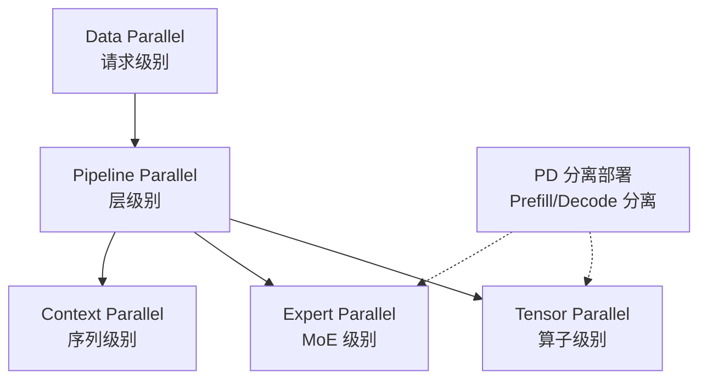

# 阶段五：分布式与并行

> vLLM 支持多种并行策略，使模型能够扩展到单机多卡乃至多节点集群。本章分析五种并行策略的原理与实现。

## 章节列表

1. [并行策略](01-parallel-strategies.md) — TP/PP/EP/DP/CP 原理
2. [通信实现](02-communication.md) — NCCL、自定义 AllReduce、设备通信器
3. [KV 与权重传输](03-kv-weight-transfer.md) — 跨节点 KV Cache 和权重同步
4. [协调机制](04-coordination.md) — 无状态协调器、Ray 集成
5. [PD 分离部署](05-pd-disaggregation.md) — Prefill/Decode 分离部署、KV Cache 跨节点通信

## 并行策略关系

