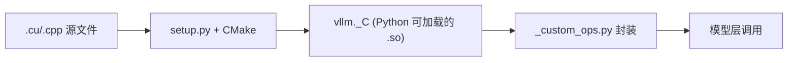

# CUDA 内核与 Python 绑定

## C++/CUDA 源码结构

`csrc/` 目录按功能域组织：

```
csrc/
├── attention/               # PagedAttention CUDA 内核
│   ├── paged_attention_v1.cu
│   └── paged_attention_v2.cu
├── core/                    # 核心调度操作
├── moe/                     # MoE 内核 (top-k softmax 等)
├── quantization/            # 量化内核 (AWQ, GPTQ, FP8)
├── cutlass_extensions/      # CUTLASS 模板特化
├── custom_all_reduce.cuh    # 自定义 AllReduce 实现
├── torch_bindings.cpp       # Python 绑定入口
└── ...
```

## Python 绑定

### 绑定入口

`csrc/torch_bindings.cpp` 使用 `pybind11` 将 C++ 函数绑定到 Python：

```cpp
PYBIND11_MODULE(vllm, m) {
    m.def("paged_attention_v1", &paged_attention_v1, "...");
    m.def("rms_norm", &rms_norm, "RMS normalization");
    m.def("silu_and_mul", &silu_and_mul, "SiLU + Multiply fusion");
    // ... 数十个绑定
}
```

### Python 侧封装

`vllm/_custom_ops.py`（~118KB）提供更高层次的 Python 封装：

```python
def rms_norm(hidden_states, weight, eps):
    try:
        return vllm._C.rms_norm(hidden_states, weight, eps)
    except AttributeError:
        return _rms_norm_python(hidden_states, weight, eps)  # fallback
```

关键设计：**自动 fallback**——当 CUDA 扩展不可用时使用纯 Python 实现。

### 另一个封装

`vllm/_aiter_ops.py`（~100KB）封装 v1 架构中的异步迭代操作。

## 构建流程


